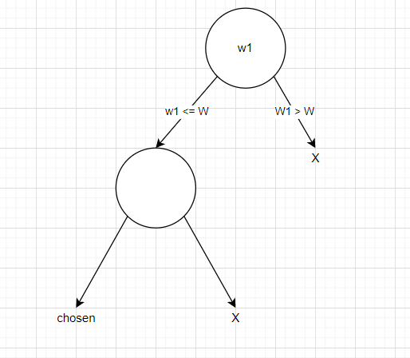

# Dynamic Programming

### Basics

Recursion -> Memoization -> Dynamic Programming
2 things necessary for identification of DP
1) Choice
2) Optimization

### Types

1) 0-1 Knapsack (6)
   1) Subset Sum
   2) Equal Sum Partition
   3) Count of Subset Sum
   4) Minimum Subset Sum Difference
   5) Target Sum
   6) Number of subset with given difference
2) Unbounded Knapsack (5)
3) Fibonacci (7)
4) LCS (15)
5) LIS (10)
6) Kadane's Algorithm (6)
7) Matrix Chain Multiplication (7)
8) DP on trees (4)
9) DP on Grid (14)
10) Others (5)

---
## KnapSack problems

Given a bag with weight capacity c
there are n items i1,i2,...,in
each with weights w1,w2,...,wn
and cost          c1,c2,...,cn
### Types

1) Greedy 
2) 0/1
3) Unbounded

---
## Solving 0/1 Knapsack

### Problem

Given
wt[] = {1,3,4,5}
val[]= {1,4,5,7}
W = 7

### Solution

For item 1, there are 2 choices either to choose it or not
If chosen, then the val will add to the profit, and reduce the capacity

For each choice, the next item can be chosen or rejected.
If the weight exceeds than surely we cannot select the item.
Between 2 choices, we will select the choice that will give us the profit



For recursive,
the base case will be if there are no elements or if the capacity is zero, in which case the answer is 0
otherwise one shall check if the item is having weight less than the bag's capacity
if true
   check the weight when included
   check the weight when excluded
   get the max of the profits
if false
   get the profit when the item is excluded

For memoization,
   store the result in a matrix of size n+1, c+1

For topdown,
   same

i.e.

* Recursive
```
if(n==0 || c == 0)
   return 0;
   
if(wt[n-1] <= c)
   int included = val[n-1] + knapsack(wt, val, c-wt[n-1], n-1)
   int excluded = knapsack(wt, val, c, n-1)
   return Math.max(included, excluded)
else
   return knapsack(wt, val, c, n-1)
```

* Memoization

```
if(t[n][c] != -1)
   return t[n][wt]

else{
   if(n==0 || c == 0){
      t[n][c] = 0;
   }
   if(wt[n-1] <= c){
      int included = val[n-1] + knapsack(wt, val, c-wt[n-1], n-1)
      int excluded = knapsack(wt, val, c, n-1)
      t[n][c] = Math.max(included, excluded)
   }
   else{
      t[n][c] = knapsack(wt, val, c, n-1)
   }
}
```

* Top Down

```
//preprocessing
t[n+1][c+1]

for(int i=0; i<t.length; i++){
   for(int j=0; j<t[i].length; j++){
      t[i][j] = 0;
   }
}

for(int i=1; i<t.length; i++){
   for(int j=1; j<t[i].length; j++){
      if(wt[i-1] <= j){
         int included = val[i-1] + t[i-1][j-wt[i-1]]
         int excluded = t[i-1][j]
         t[i][j] = Math.max(included, excluded) 
      }
      else{
         t[i][j] = t[i-1][j]
      }
   }
}
```
